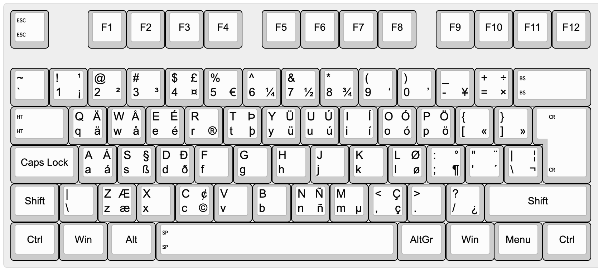

# MacOS US International without dead keys

After using the US International AltGr layout under unix and [win-us-intl-altgr](https://github.com/thomasfaingnaert/win-us-intl-altgr) under Windows for several years and due switching to MacOS at work, I found that the layout is not available or at least there is nothing comparable.

With the help of [this](http://kbdlayout.info/viewer) I was able to copy every character into [Ukulele](https://software.sil.org/ukelele/) and export it as a key layout.

## Layout



## Installation

1. To install the keyboard layout open `Terminal` on your mac and execute the command below.
```
curl -sL https://api.github.com/repos/dnnspaul/macos-us-intl-no-dead-keys/tarball/main | sudo tar xz --exclude=README.md --exclude=KeyboardLayout.png --strip=1 -C /Library/Keyboard\ Layouts/
```
2. Enter your password. This is required because the keyboard layout is installed for all users on your mac.
3. Open `System Preferences` -> `Keyboard` -> `Input Sources`
4. Click `+` and add `US Intl without dead keys` (category `English`) (Note: If the keyboard is not displayed, you may have to restart your device)
5. Check `☑ Show Input menu in menu bar`.
6. In the menu bar (top right) select `US Intl without dead keys`.